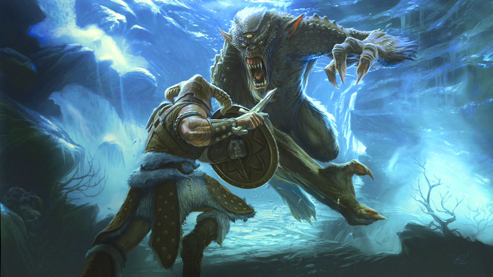

<h1>Skyrim LE/SE/AE Main Menu Music and Background Replacer | Замена фона и музыки главного меню Skyrim LE/SE/AE | by Skadaar</h1>

<h3>New background | Новый фон Главного Меню:</h3>

<h3>New Music (YouTube link) | Новая музыка (ссылка на YouTube):</h3>

[The Dragonborn Comes - cover in Russian | Драконорождённый придёт - кавер на русском by Cactus In A Scarf](https://youtu.be/vdUbjpFvumI?si=BsbrIRwH5Fcggj9i/)

<h4>Текст Песни</h4>

Наш воин, герой наш, настал твой черёд 
Я верю, Драконорождённый придёт 
Его голос в себе силу Нордов несёт 
Поверь и ты, он скоро придёт

И наступит конец всем Скайримским врагам 
Близка ваша гибель, идёт герой к нам 
Возродится легенда из тьмы и руин 
Тогда ты поймёшь - пришёл Довакин

Dovahkiin, Dovahkiin 
Naal ok zin los vahriin 
Wah dein vokul mahfaeraak ahst vaal 
Ahrk fin norok paal graan 
Fod nust hon zindro zaan 
Dovahkiin, fah hin kogaan mu draal 

<h4>Установка:</h4>

Распакуйте архив в папку с игрой с заменой файлов или используйте удобный вам мод менеджер (рекоммендовано).

<h4>Installation:</h4>

Unpack the archive into the game folder and replace the files or use a mod manager(recommended) that is convenient for you.

<path d="M2.75 14A1.75 1.75 0 0 1 1 12.25v-2.5a.75.75 0 0 1 1.5 0v2.5c0 .138.112.25.25.25h10.5a.25.25 0 0 0 .25-.25v-2.5a.75.75 0 0 1 1.5 0v2.5A1.75 1.75 0 0 1 13.25 14Z"></path>
<path d="M7.25 7.689V2a.75.75 0 0 1 1.5 0v5.689l1.97-1.969a.749.749 0 1 1 1.06 1.06l-3.25 3.25a.749.749 0 0 1-1.06 0L4.22 6.78a.749.749 0 1 1 1.06-1.06l1.97 1.969Z"></path>

